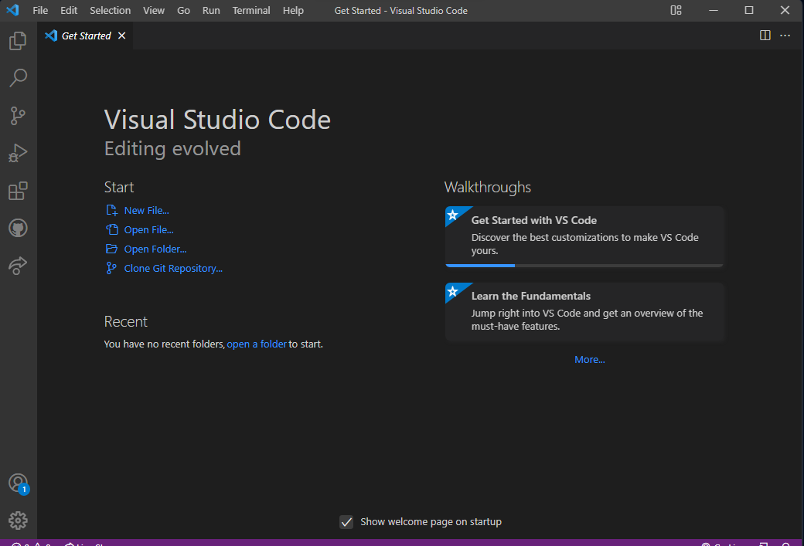

# Lab1Web

## Nama     : Muhammad Romdhon
## NIM      : 312010434
## Kelas    : TI.20.A1
## Matkul   : Pemograman web

## Belajar dasar HTML
## Langkah - langkah praktikum

  *Assalamualaikum* 
  Nama saya Muhammad disini saya akan menjalankan cara membuat web  dengan html
  pertama siapkan Visual Studio Code dan browser
