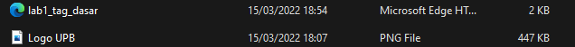
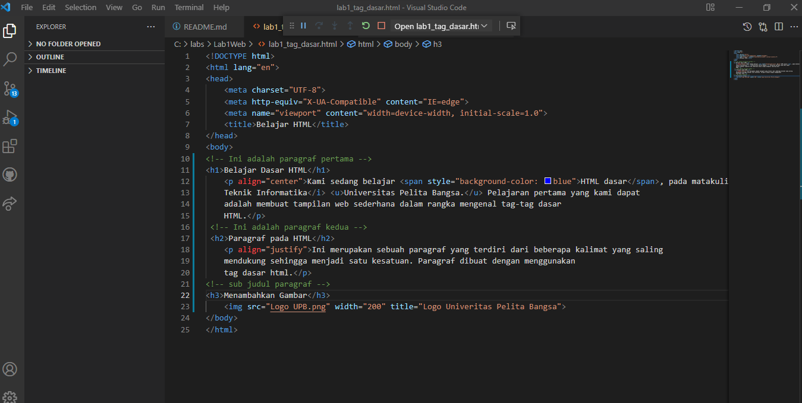
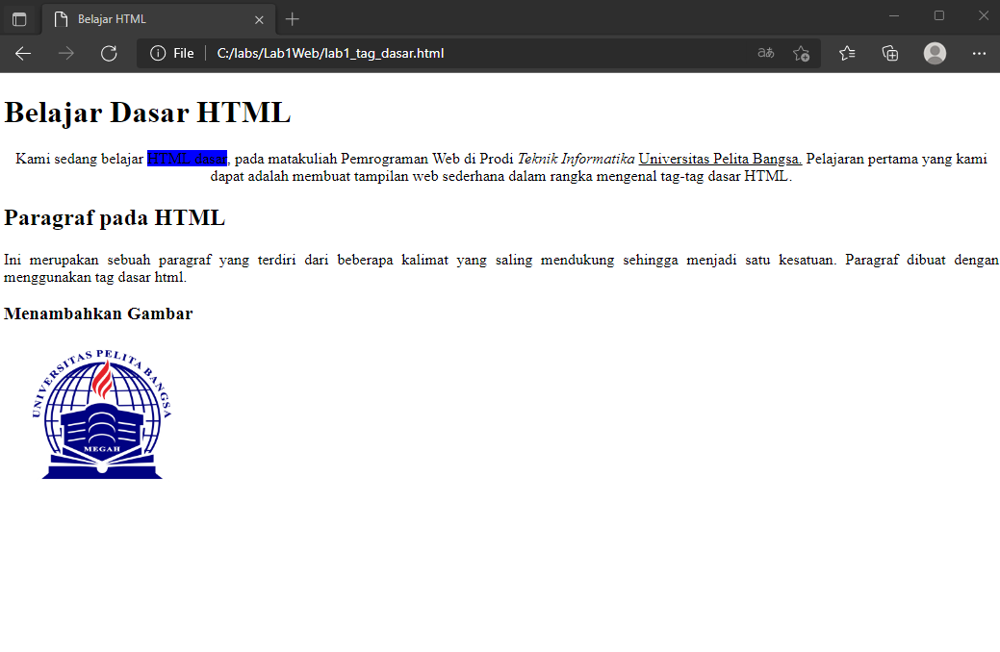
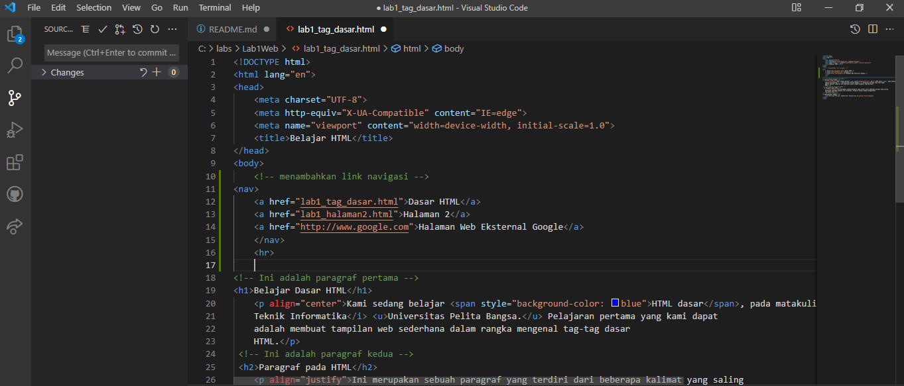
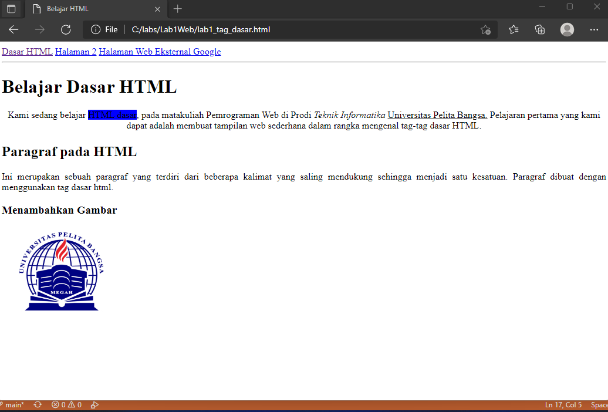

# Lab1Web

## Nama     : Muhammad Romdhon
## NIM      : 312010434
## Kelas    : TI.20.A1
## Matkul   : Pemograman web

## Belajar dasar HTML
## Langkah - langkah praktikum

  *Assalamu'alaikum Warahmatullahi wabarakatuh* 
  Nama saya Muhammad Romdhon disini saya akan menjelaskan cara membuat web  dengan html
  pertama siapkan *Visual Studio* Code dan *browser*

  Kemudian buat file baru dengan nama **lab1_tag_dasar.html**

  Selanjutnya buka file tersebut menggunakan browser. Disini saya menggunakan *Microsoft Edge*

## 1. Membuat Paragraf
  Buatlah paragraf sederhana seperti berikut ini. Dan kemudian lihat hasilnya dengan menrefresh pada web browser

  Kemudian atur atribut paragraf seperti berikut dan lihat perubahannya

  simpan dan refresh web browser untuk melihat perubahannya. Selanjutnya untuk mengubah model paragraf nilai atributnya  (algin = Justify, left, right, dan center) untuk melihat perbdaannya

## 2. Menambahkan Judul 
  Judul memiliki 6 level yang berbeda mulai dari h1 sampai h6. kemudian tambahkan judul h1 sebelum paragraf pertama dan tambahkan sub judul h2 sebelum paragrf ke-2

  simpan dan lihat perubahannya

## 3. Memformat Teks
  Lakukan formatan teks yang ada pada paragraf yang sudah ada sebelumnya, mengacu kepada penjelasan materi pemformatan teks sehingga tampilannya akan berbeda seperti berikut.
  masukan code teks seperti berikut untuk melihat perubahan.

  Dan hasilnya akan seperti ini.

## 4. Menyisipkan Gambar
  Untuk menyisipkan gambar, siapkan terlebih dahulu gambar yang ingin dimasukan pada HTML dan sisipkan atau taruh gambar pada suatu folder dengan HTML seperti gambar berikut :

  Kemudian tambahkan tag img setelah paragraf kedua, dengan menambahkan Heading 3 sebelumnya seperti berikut :

  Gambar akan ditampilkan apa adanya sesuai ukuran. Untuk mengatur ukuran gambar dapat menggunakan atribut `witdh` dan `height` dengan nilai interger yang disesuaikan seperti contoh di atas. Nanti gambar akan seperti berikut ini :

## 5. Menambahkan Hyper Links

  Tambahkan Hyperlink pada dokumen sebelum heading 1 seperti gambar berikut : 

  Nanti hyperlink akan berada di atas seperti gambar berikut :

 
   Sekian penjelasan dari saya tentang membuat HTML menggunakan *Visual Studio Code* semoga muda di pahami sekian dari saya.
 
Terima Kasih

   *Wassalamu'alaikum Warahmatullahi Wabarakatuh*