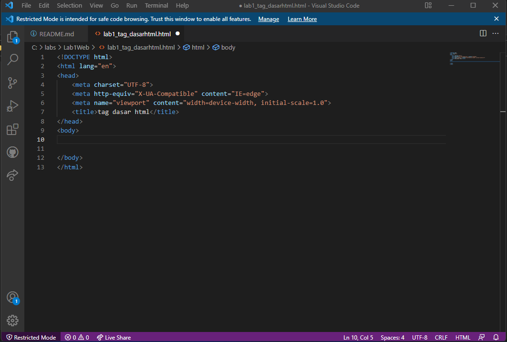
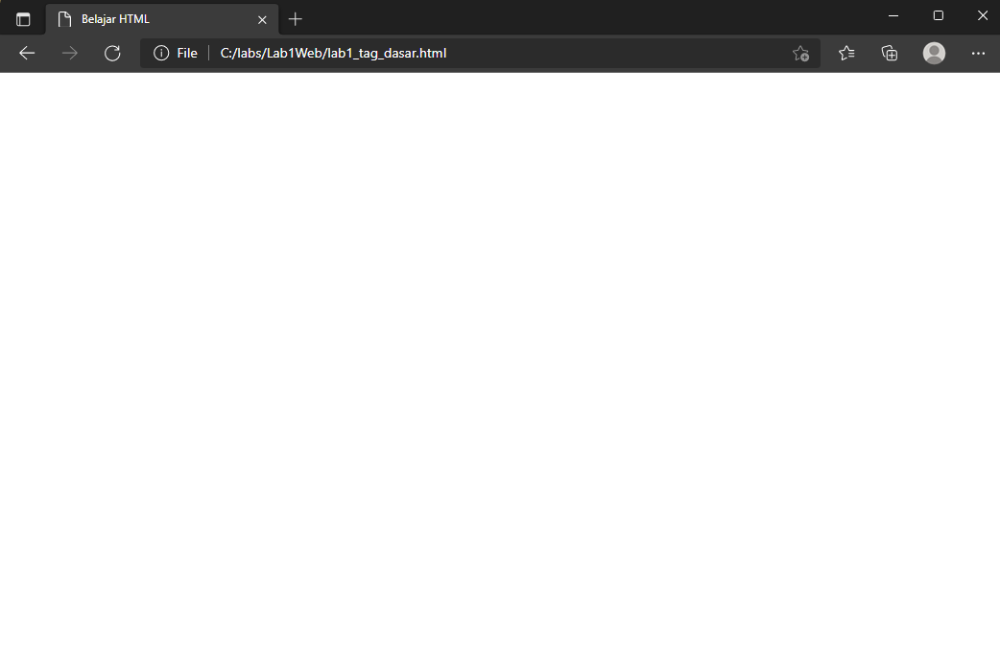
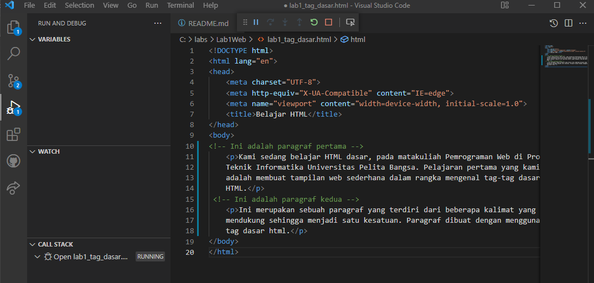
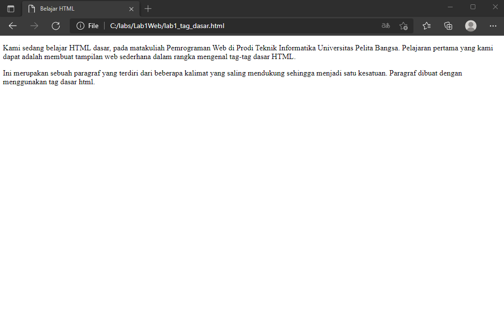
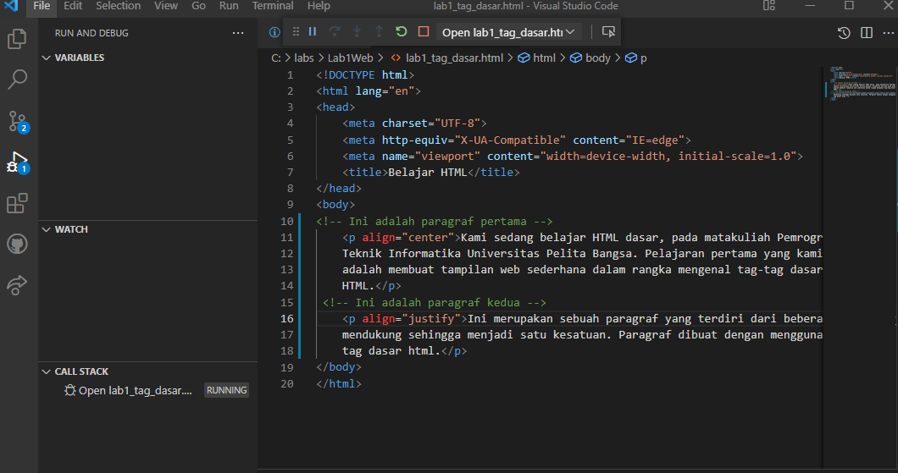
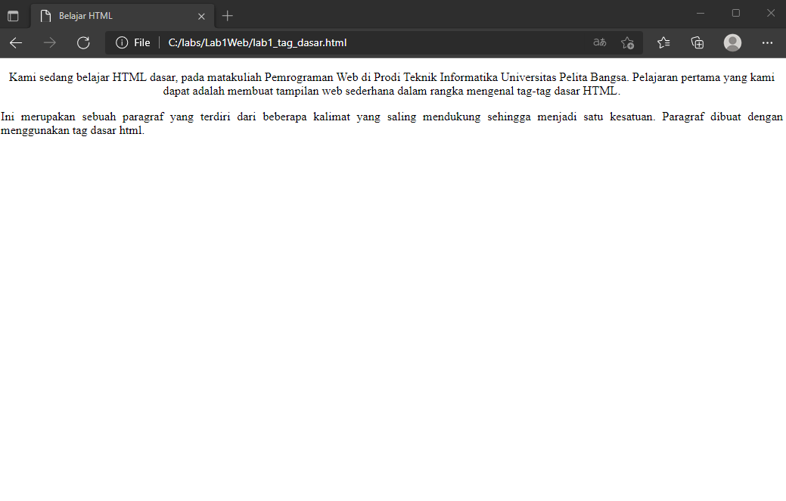
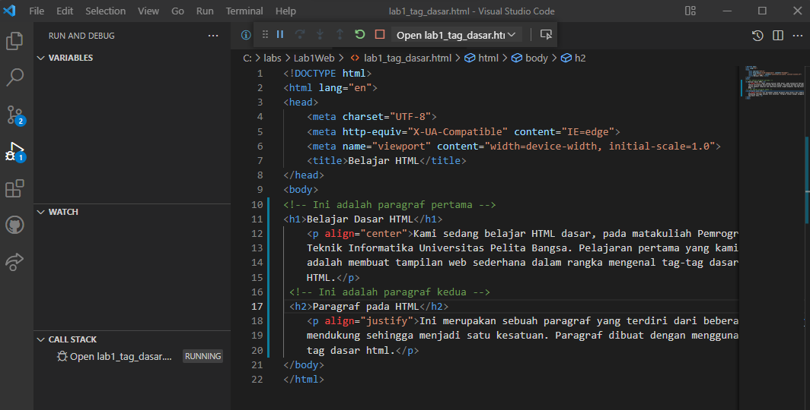
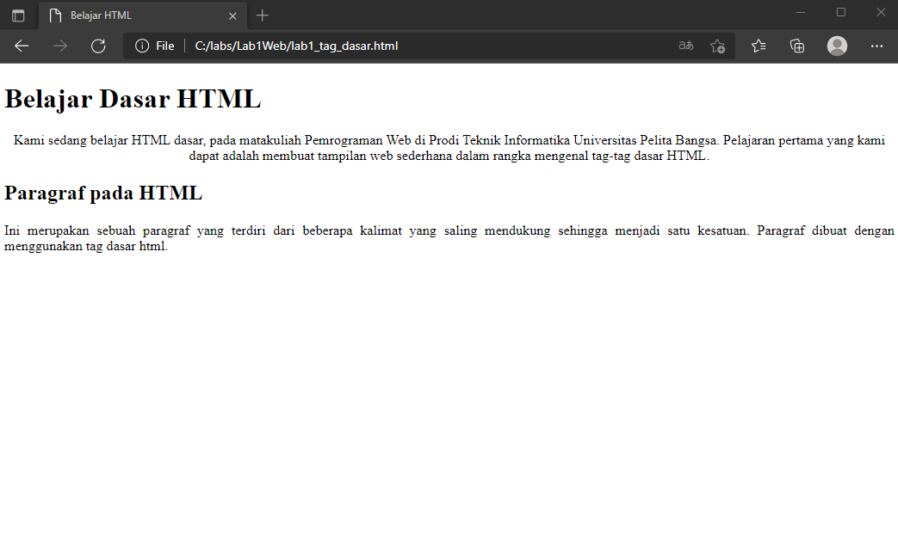
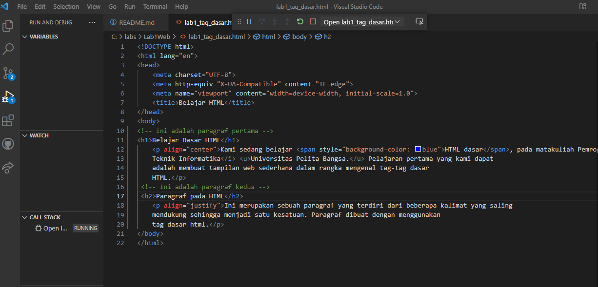

# Lab1Web

## Nama     : Muhammad Romdhon
## NIM      : 312010434
## Kelas    : TI.20.A1
## Matkul   : Pemograman web

## Belajar dasar HTML
## Langkah - langkah praktikum

  *Assalamualaikum* 
  Nama saya Muhammad disini saya akan menjalankan cara membuat web  dengan html
  pertama siapkan Visual Studio Code dan browser

  Kemudian buat file baru dengan nama **lab1_tag_dasar.html**

  Selanjutnya buka file tersebut menggunakan browser. Disini saya menggunakan *Microsoft Edge*

## 1. Membuat Paragraf
  Buatlah paragraf sederhana seperti berikut ini. dan kemudian lihat hasilnya dengan menrefresh pada web browser

  Kemudian atur atribut paragraf seperti berikut dan lihat perubahannya

  simpan dan refresh web browser untuk melihat perubahannya. Selanjutnya untuk mengubah model paragraf nilai atributnya  (algin = Justify, left, right, dan center) untuk melihat perbdaannya

## 2. Menambahkan Judul 
  Judul memiliki 6 level yang berbeda mulai dari h1 sampai h6. kemudian tambahkan judul h1 sebelum paragraf pertama dan tambahkan sub judul h2 sebelum paragrf ke-2

  simpan dan lihat perubahannya

## 3. Memformat Teks
  Lakukan formatan teks yang ada pada paragraf yang sudah ada sebelumnya, mengacu kepada penjelasan materi pemformatan teks sehingga tampilannya akan berbeda seperti berikut.
  masukan code teks seperti berikut untuk melihat perubahan.

  Dan hasilnya akan seperti ini.
