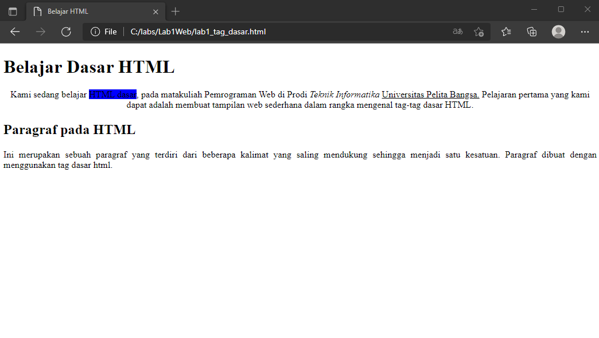

# Lab1Web

## Nama     : Muhammad Romdhon
## NIM      : 312010434
## Kelas    : TI.20.A1
## Matkul   : Pemograman web

## Belajar dasar HTML
## Langkah - langkah praktikum

  *Assalamu'alaikum Warahmatullahi wabarakatuh* 
  Nama saya Muhammad Romdhon disini saya akan menjelaskan cara membuat web  dengan html
  pertama siapkan *Visual Studio* Code dan *browser*

  Kemudian buat file baru dengan nama **lab1_tag_dasar.html**

  Selanjutnya buka file tersebut menggunakan browser. Disini saya menggunakan *Microsoft Edge*

## 1. Membuat Paragraf
  Buatlah paragraf sederhana seperti berikut ini. Dan kemudian lihat hasilnya dengan menrefresh pada web browser

  Kemudian atur atribut paragraf seperti berikut dan lihat perubahannya

  simpan dan refresh web browser untuk melihat perubahannya. Selanjutnya untuk mengubah model paragraf nilai atributnya  (algin = Justify, left, right, dan center) untuk melihat perbdaannya

## 2. Menambahkan Judul 
  Judul memiliki 6 level yang berbeda mulai dari h1 sampai h6. kemudian tambahkan judul h1 sebelum paragraf pertama dan tambahkan sub judul h2 sebelum paragrf ke-2

  simpan dan lihat perubahannya

## 3. Memformat Teks
  Lakukan formatan teks yang ada pada paragraf yang sudah ada sebelumnya, mengacu kepada penjelasan materi pemformatan teks sehingga tampilannya akan berbeda seperti berikut.
  masukan code teks seperti berikut untuk melihat perubahan.

  Dan hasilnya akan seperti ini.

## 4. Menyisipkan Gambar
  Untuk menyisipkan gambar, siapkan terlebih dahulu gambar yang ingin dimasukan pada HTML dan sisipkan atau taruh gambar pada suatu folder dengan HTML seperti gambar berikut :

  Kemudian tambahkan tag img setelah paragraf kedua, dengan menambahkan Heading 3 sebelumnya seperti berikut :

  Gambar akan ditampilkan apa adanya sesuai ukuran. Untuk mengatur ukuran gambar dapat menggunakan atribut `witdh` dan `height` dengan nilai interger yang disesuaikan seperti contoh di atas. Nanti gambar akan seperti berikut ini :

## 5. Menambahkan Hyper Links

  Tambahkan Hyperlink pada dokumen sebelum heading 1 seperti gambar berikut : 

  Nanti hyperlink akan berada di atas seperti gambar berikut :

 
   Sekian penjelasan dari saya tentang membuat HTML menggunakan *Visual Studio Code* semoga muda di pahami sekian dari saya.
   
 **Terima Kasih**

   *Wassalamu'alaikum Warahmatullahi Wabarakatuh*

 ## Jawab pertanyaan berikut 
   1. Lakukan perubahan pada kode sesuai dengan keinginan anda, amati perubahannya adakah
error ketika terjadi kesalahan penulisan tag?
  2. Apa perbedaan dari tag < p > dengan tag < br >, berikan penjelasannya!
  3. Apa perbedaan atribut title dan alt pada tag , berikan penjelasannya!
  4. Untuk mengatur ukuran gambar, digunakan atribut width dan height. Agar tampilan gambar
proporsional sebaiknya kedua atribut tersebut diisi semua atau tidak? Berikan penjelasannya!
  5. Pada link tambahkan atribut target dengan nilai atribut bervariasi ( _blank, _self, _top,
_parent ), apa yang terjadi pada masing-masing nilai antribut tersebut?

## Jawaban
  1. Saya akan melakukan perbedaan Tag-tag HTML sebelum dan sesudah perubahan. sebalum perubahan akan seperti gambar berikut ini:

  Setelah perubahan gambar akan seperti berikut ini :

  Disini saya melakukan perubahan dengan menghilangkan akhiran tag `</h1>` menjadi `<h1>` maka akan terjadi seluruh elemen dibawah tag terebut akan berubah mengikuti tag `<h1>` dikarenakan tidak ada penutup pada tag tersebut.

  2. Tag `
` berfungsi untuk memberi perintah paragraf pada HTML. Tag ` ` berfungsi untuk memberikan perintah breakline atau baris baru, seperti gambar berikut ini:

  3. `title` berfungsi untuk memberikan judul pada gambar, sedangkan `alt` berfungsi untuk deskripsi tentang gambar, seperti gambar dibawah ini menunjukan perbedaan `title` dan `alt`.

  4. Menurut saya tidak harus menggunakan keduanya karena jika menggunakan keduanya dengan ukuran angka yang sama ukuran gambar pada web tidak simetris. sedangkan jika hanya mengunakan salah satu ukurannya akan bertambah besar secara simetris. contoh seperti gambar di bawah berikut ini :

  5. `<_blank>` untuk membuka link di tab baru 
        `<_self>` untuk membuka link di frame link itu berada
        `<_top>` untuk membuka link di frame paling atas (paling luar). contohnya jika website (A) di dalamnya ada website (B) lalu di website (B) di dalamnya ada website (C) lalu di website (C) ini ada link dan kita klik, maka link akan terbuka di websiite (C).
        `<_parent>` untuk membuka link di frame yang satu tingkat di atas frame link tersebu berada. contohnya jika website (A) di dalamnya ada website (B) lalu di website (B) ini ada link dan kita klik, maka link akan terbuka di website (A).